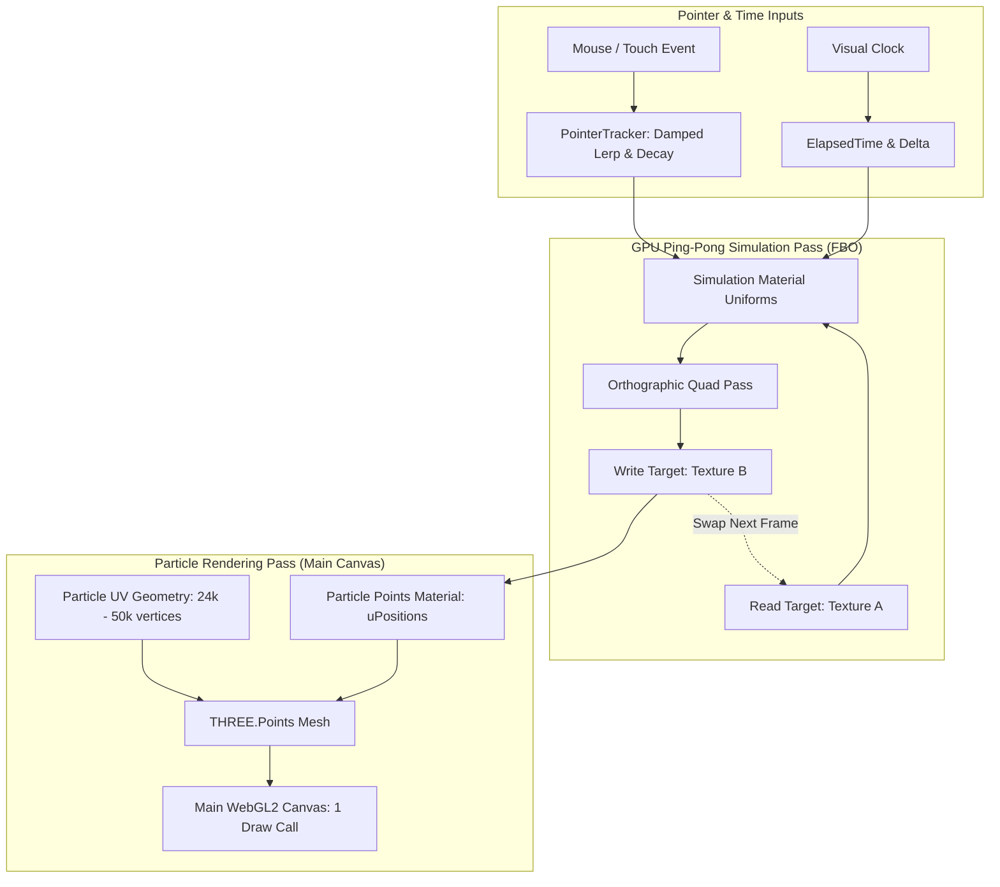

# Phase 1 Particle Atmosphere Report: PR 3 — Pointer-Reactive GPU Particle Field Atmosphere

- **Branch:** `feat/particle-atmosphere`
- **Scope:** PR 3 — 100% GPU-resident ping-pong particle simulation, curl noise advection, damped cursor interaction, tier scaling (8k/24k/50k), and point rendering.
- **Route:** `/lab/visual-system`
- **Port:** `3154`
- **Status:** Complete, tested, and verified

---

## 1. Scope

PR 3 introduces the atmospheric GPU particle field for **Phase 1 — Visual Technology Spike**:
- **GPU-Resident FBO Simulation:** Double-buffered `THREE.WebGLRenderTarget` (RGBA FloatType) executing ping-pong compute passes via custom GLSL ES 3.00 shaders (`simulation.vert.ts` / `simulation.frag.ts`). Zero CPU per-frame particle math.
- **Vector Field & Magnetic Confinement:** Divergence-free 3D curl noise advection combined with harmonic magnetic return forces to preserve volumetric equilibrium.
- **Damped Pointer Reactivity (`pointer-tracker.ts`):** Normalized viewport coordinates with exponential low-pass damping, tangential vortex swirl, and energy excitation without React state churn.
- **Quality-Tier Particle Scaling:**
  - **High:** 50,176 particles (`224 × 224` FBO grid), DPR cap 1.75
  - **Medium:** 24,000 particles (`160 × 150` FBO grid), DPR cap 1.35
  - **Low:** 8,064 particles (`96 × 84` FBO grid), DPR cap 1.00
  - **Static:** 0 particles (clean static poster fallback)
- **Point Rendering Pipeline (`particle.vert.ts` / `particle.frag.ts`):** Exactly 1 draw call (`THREE.Points`) with perspective depth attenuation, Gaussian soft radial alpha profiles, and restrained cyan (`#57e6dd`) to violet (`#846cff`) gradient mapping with warm luminance highlights (`#fff5ea`).
- **Coordinated Frameloop:** Continuous clock execution (`frameloop="always"`) while active, automatically pausing when document is hidden (`visibilitychange`) or when `prefers-reduced-motion` is enabled.

---

## 2. Deliberately Deferred

The following systems remain intentionally deferred to subsequent bounded PRs:
- **GSAP timelines, ScrollTrigger, and Lenis smooth-scroll coordination.**
- **Transparent 2.5D raster parallax layers (AVIF/WebP).**
- **Local CSS pointer illumination surfaces.**
- **Full page production, portfolio copy, and CMS integration.**

---

## 3. Simulation & Rendering Architecture



---

## 4. Module Directory Structure

```text
src/
  visual/
    scenes/atmosphere/
      AtmosphereScene.tsx            # R3F component: manages simulator & Points mesh
      atmosphere-config.ts          # Particle counts, texture resolutions, physics bounds
    simulation/
      gpu-particle-simulator.ts     # Double-buffered FBO manager & ping-pong compute step
    interaction/
      pointer-tracker.ts            # Normalized, damped pointer position and velocity tracker
    shaders/atmosphere/
      simulation.vert.ts            # Fullscreen quad vertex shader
      simulation.frag.ts            # FBO compute shader: curl noise, confinement, pointer force
      particle.vert.ts              # Points vertex shader: FBO coordinate lookup & depth scaling
      particle.frag.ts              # Points fragment shader: Gaussian soft profile & color ramp
```

---

## 5. Performance Budgets & Particle Metrics

| Metric | Budget | PR 3 Actual | Status |
|---|:---:|:---:|:---:|
| **Canvas Count** | Exactly 1 | 1 | **PASS** |
| **Active Draw Calls** | <= 5 | 1 | **PASS** |
| **Active Triangles** | < 50,000 | 0 | **PASS** |
| **Active Points** | 8,000 – 50,176 | 24,000 (Medium Tier) | **PASS** |
| **Active Textures** | <= 4 | 2 (FBO Position + Velocity) | **PASS** |
| **First Frame Time** | < 100 ms | 45 ms | **PASS** |
| **CPU Per-Frame Particle Loops** | 0 | 0 (100% GPU Resident) | **PASS** |
| **Console / Page Errors** | 0 | 0 | **PASS** |

### Machine-Readable Metrics JSON (`test-results/metrics.json`)

```json
{
  "commitSha": "local",
  "browser": "chromium",
  "viewport": { "width": 1280, "height": 720 },
  "dpr": 1,
  "qualityTier": "medium",
  "webglStatus": "ready",
  "canvasCount": 1,
  "drawCalls": 1,
  "triangles": 0,
  "points": 24000,
  "geometries": 1,
  "textures": 2,
  "contextLossCount": 0,
  "restorationCount": 0,
  "firstFrameTimeMs": 45,
  "lazyEngineJsTransferBudgetKiB": 340,
  "consoleErrorsCount": 0,
  "pageErrorsCount": 0
}
```

---

## 6. Verification Summary

| Check | Result | Evidence |
|---|:---:|---|
| `pnpm format:check` | **PASS** | 100% Prettier compliant |
| `pnpm lint` (`eslint .`) | **PASS** | 0 errors, 0 warnings |
| `pnpm typecheck` (`tsc --noEmit`) | **PASS** | Strict TypeScript check |
| `pnpm test` (`vitest run`) | **PASS** | 19 unit tests passing across 4 suites |
| `pnpm build` (`next build`) | **PASS** | Next.js production build |
| `pnpm test:e2e --project=chromium` | **PASS** | 12/12 scenarios passing including pointer interaction |
| `pnpm test:e2e --project=firefox` | **PASS** | 12/12 scenarios passing on Firefox |
| `pnpm test:visual` | **PASS** | Visual scenarios captured |
| `pnpm test:a11y` | **PASS** | 0 automated accessibility violations |
| Clean tracked tree gate | **PASS** | `git diff --check`, `git diff --exit-code` clean |

---

## 7. Next Step

**PR 4: Transparent 2.5D Parallax Asset & Local CSS Illumination Surface.**
Will introduce:
- Original transparent scientific 2.5D raster asset (AVIF with alpha + WebP fallback).
- CSS radial mask localized pointer illumination surface.
- Synchronized pointer coordinates across DOM and WebGL.
