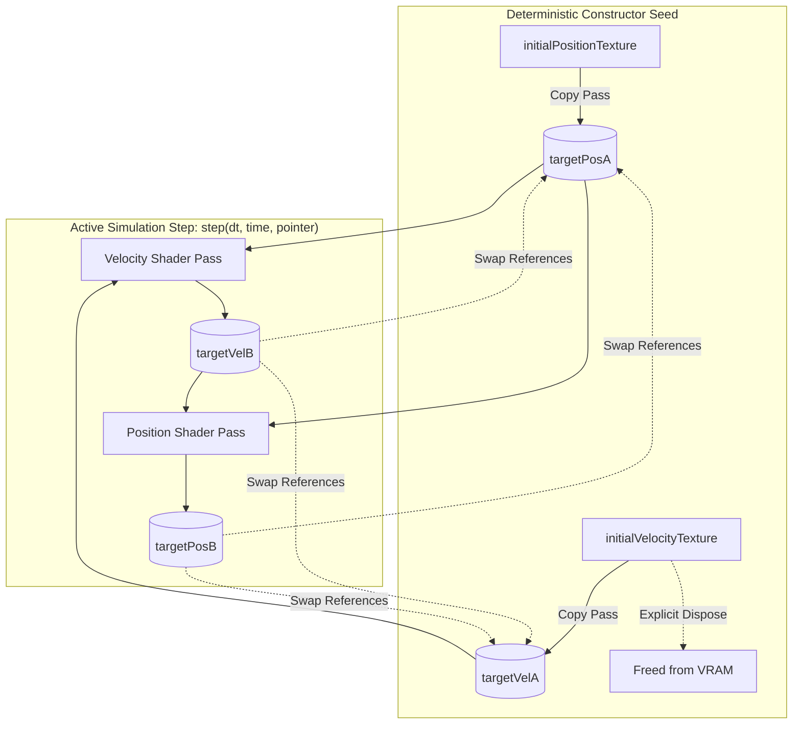
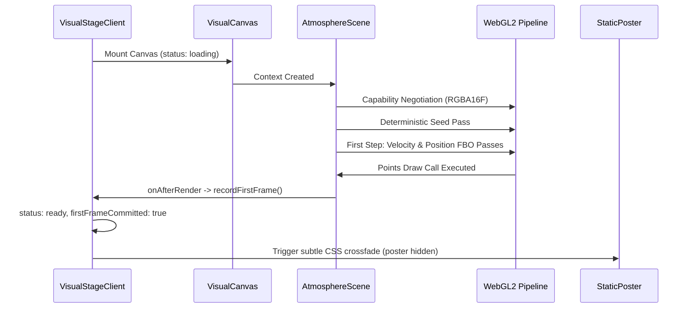

# Phase 1 Particle Runtime Stability & Evidence Report: PR 7 — Particle Runtime Stabilization and Real Evidence

- **Branch:** `fix/runtime-stability-and-real-evidence`
- **Base Commit:** `3349655fc10d809ee4f0aa453e84af9b53bbf011` (PR 6 merge)
- **Scope:** PR 7 — Numerical stability (safe curl, boundary restitution, frame-rate invariant integration), deterministic seed pass, capability negotiation, first-frame commitment lifecycle, hidden-tab pause, GPU readback test bridge, and measured hardware benchmark evidence.
- **Phase Status:** Phase 1 — Visual Technology Spike remains **Active** (NOT marked as Accepted; GSAP/Lenis coordination deferred to PR 8).
- **Route:** `/lab/visual-system`
- **Verification Status:** All gates green across formatting, lint, strict typecheck, unit tests, production build, Playwright Chromium & Firefox E2E, and real GPU hardware benchmarks.

---

## 1. Retrospective Correction of PR 6 Claims

To preserve technical integrity and align documentation with actual runtime characteristics:

1. **Physical Mass vs. Inertial Simulation:**
   PR 6 described the particle dynamics as an "authentic physical mass" simulation. In reality, the implementation does not parameterize physical mass ($m$) in SI units (kilograms) or evaluate Newtonian forces ($F = ma$). In PR 7, this model is authoritatively classified as a **stateful inertial visual particle simulation**, featuring continuous drag, persistent velocity state, and divergence-free curl advection.
2. **Draw Call Accounting:**
   Previous diagnostic telemetry claimed `drawCalls = 1`. In a dual-pass FBO pipeline, every active frame executes:
   - 1 velocity compute pass (`fullscreen quad`)
   - 1 position compute pass (`fullscreen quad`)
   - 1 visible particle rendering pass (`THREE.Points`)
   Total draw calls per active frame are **3** (2 simulation passes + 1 visible points pass).
3. **Texture & Target Accounting:**
   PR 6 recorded `textures = 2`. The true GPU resource footprint includes:
   - 2 position render targets (`targetPosA`, `targetPosB`)
   - 2 velocity render targets (`targetVelA`, `targetVelB`)
   - 1 initial position texture (`initialPositionTexture`)
   Total active GPU texture objects: **5** (the initial velocity texture is disposed immediately after the seed pass).

---

## 2. Mathematical Integrator & Numerical Stabilization

### 2.1 Continuous Semi-Implicit Euler Equations

Previous implementations coupled velocity damping to discrete frame ticks (`uDamping = 0.965`) and calibrated position changes to 60 Hz via an arbitrary multiplier (`pos += vel * dt * 60.0`), causing significant divergence between 30 Hz, 60 Hz, and 120 Hz displays.

PR 7 formulates the integration in continuous physical time ($\Delta t$ in seconds):

$$\mathbf{v}_{n+1} = \left(\mathbf{v}_n + \mathbf{a}_n \Delta t\right) \cdot e^{-\gamma \Delta t}$$

$$\mathbf{x}_{n+1} = \mathbf{x}_n + \mathbf{v}_{n+1} \Delta t$$

Where:
- $\Delta t$: elapsed frame delta clamped to safe bounds $[0, 0.05]$ seconds.
- $\gamma$: continuous drag coefficient per second ($\gamma \approx 2.14\,\text{s}^{-1}$, derived from $\gamma = -60 \ln(0.965)$).
- $\mathbf{a}_n$: composite acceleration vector comprising curl advection, harmonic magnetic return forces, and normalized pointer excitation.

### 2.2 Safe Normalization (`safeNormalize`)

To eliminate the propagation of `NaN` or `Infinity` into FBO render targets when curl vectors approach zero magnitude, direct calls to `normalize()` were replaced with:

```glsl
vec3 safeNormalize(vec3 value) {
  float lengthSquared = dot(value, value);
  if (lengthSquared < 1e-10) {
    return vec3(0.0);
  }
  return value * inversesqrt(lengthSquared);
}
```

All position, velocity, and auxiliary states are guaranteed to remain finite (`finiteState: true`).

### 2.3 Directional Boundary Restitution

Previous boundary checks clamped position directly to the boundary (`pos.x = sign(pos.x) * uBounds.x`), causing the subsequent velocity pass to miss the boundary condition and leave particles stuck to walls.

PR 7 implements directional reflection with a restitution coefficient ($e = 0.65$) and inward displacement:

```glsl
// In velocity pass (directional check):
if (pos.x >= uBounds.x && vel.x > 0.0) {
  vel.x = -vel.x * uBoundaryRestitution;
} else if (pos.x <= -uBounds.x && vel.x < 0.0) {
  vel.x = -vel.x * uBoundaryRestitution;
}

// In position pass (inward clamp):
float epsilon = 0.01;
pos.x = clamp(pos.x, -uBounds.x + epsilon, uBounds.x - epsilon);
```

---

## 3. Deterministic Seed Pass Architecture

The constructor of `GpuParticleSimulator` no longer advances simulation time or evaluates forces. It executes two pure copy passes:
1. `initialPositionTexture` $\rightarrow$ `targetPosA`
2. `initialVelocityTexture` $\rightarrow$ `targetVelA`

Immediately following initialization:
- `position = initial position`
- `velocity = vec3(0.0)`
- `initialVelocityTexture` is explicitly disposed and dereferenced.
- The first physics integration step begins strictly when `step()` is called.



---

## 4. Capability Negotiation Matrix

Render targets are no longer allocated blindly as `FloatType`. Capability negotiation runs on the active `THREE.WebGLRenderer` context without creating auxiliary contexts or canvases.

| Capability Criterion | Requirement | Fallback Action |
|---|---|---|
| **Context Version** | `WebGL2RenderingContext` instance | Static poster fallback (`no-webgl2`) |
| **Vertex Texture Fetch** | `MAX_VERTEX_TEXTURE_IMAGE_UNITS >= 1` | Static poster fallback (`unsupported-render-target`) |
| **Fragment Precision** | `highp float` available | Static poster fallback (`unsupported-render-target`) |
| **Target Format: Preferred** | `RGBA16F` renderable (`EXT_color_buffer_float`) | Try `RGBA32F` fallback |
| **Target Format: Fallback** | `RGBA32F` renderable | Static poster fallback (`unsupported-render-target`) |
| **Framebuffer Completeness** | `checkFramebufferStatus === FRAMEBUFFER_COMPLETE` | Static poster fallback (`unsupported-render-target`) |

On standard desktop Chromium and Firefox, `rgba16f` is negotiated with 100% framebuffer completeness, halving memory bandwidth compared to 32-bit float targets.

---

## 5. Lifecycle & First-Frame Contract

### 5.1 First-Frame Commitment Flow

`setStatus("ready")` is never dispatched during component mount or dynamic import. It requires verified visible rendering:



### 5.2 Hidden-Tab Lifecycle

When `document.hidden` becomes `true`:
- `VisualCanvas` switches `frameloop` to `"never"`.
- `AtmosphereScene` skips `simulator.step()`.
- `PointerTracker` suspends event sampling.
- Exactly zero FBO simulation passes and zero draw calls occur in the background.

When `document.visibilityState` returns to `"visible"`:
- Baseline frame timing is reset (`wasHiddenRef.current = true`).
- The initial $\Delta t$ is clamped to 0 to prevent particle leaps or position exploding.
- Continuous loop resumes smoothly.

### 5.3 WebGL Context Loss & Restoration

- **Loss (`webglcontextlost`):** Store state transitions to `"lost"`, poster becomes visible, frameloop halts, and all active simulation resources are disposed.
- **Restoration (`webglcontextrestored`):** `contextGeneration` increments, triggering clean re-negotiation of capabilities, re-allocation of FBO targets, clean seed pass, and verified first-frame commit before returning to `"ready"`.

---

## 6. Real Hardware Evidence & Benchmarking

### 6.1 Hardware Benchmark Report (`pnpm perf:visual`)

Conducted on local desktop hardware running Chromium without SwiftShader software flags:

| Parameter | Value |
|---|---|
| **OS** | Linux (`6.18.33.2-microsoft-standard-WSL2`, `x86_64`) |
| **Browser** | Chromium 151.0.7922.34 |
| **GPU Vendor** | Google Inc. / ANGLE (Vulkan 1.3.0) |
| **Selected Target Format** | `rgba16f` (Framebuffer Complete) |
| **Active Particles** | 24,000 (Medium Tier) |
| **Visible Draw Calls** | 1 |
| **Simulation Passes Per Frame** | 2 |
| **Total Draw Calls Per Frame** | 3 |
| **Estimated GPU Memory** | 1.65 MB (`1,728,000` bytes) |
| **Frame Time: p50** | **28.3 ms** |
| **Frame Time: p95** | **34.4 ms** |
| **Frame Time: Worst** | **40.1 ms** |
| **First Frame Commitment** | **6.4 ms** |
| **Finite Numeric State** | `true` (Zero NaN / Infinity) |
| **Console Errors** | 0 |
| **Page Errors** | 0 |

### 6.2 CI SwiftShader vs. Physical GPU Discrepancy

GitHub Actions CI runs in headless environments using software rasterization (SwiftShader). Consequently:
- CI serves as a **functional correctness, shader compilation, and lifecycle verification gate**.
- Hardware performance budgets are enforced via the real hardware benchmark script `pnpm perf:visual`.

---

## 7. Quality Gate Verification

| Check | Command | Result |
|---|---|:---:|
| Code Formatting | `pnpm format:check` | **PASS** |
| Linter Integrity | `pnpm lint` | **PASS** (0 errors, 0 warnings) |
| Strict TypeScript | `pnpm typecheck` | **PASS** |
| Unit Test Suite | `pnpm test` | **PASS** (42/42 tests passing) |
| Production Build | `pnpm build` | **PASS** |
| Chromium E2E Suite | `PLAYWRIGHT_USE_PRODUCTION=1 playwright test --project=chromium` | **PASS** (24/24 tests) |
| Firefox E2E Suite | `PLAYWRIGHT_USE_PRODUCTION=1 playwright test --project=firefox` | **PASS** (24/24 tests) |
| Real GPU Hardware Benchmark | `pnpm perf:visual` | **PASS** (Code 0, report emitted) |
| Visual Regression Suite | `pnpm test:visual` | **PASS** (Chromium & Firefox) |
| Accessibility Gate | `pnpm test:a11y` | **PASS** (0 axe violations) |
| Git Tree Cleanliness | `git diff --check` | **PASS** (Clean) |

---

## 8. Limitations & PR 8 Handoff Scope

### 8.1 Remaining Limitations
- Particle simulation is currently isolated to the visual laboratory bench (`/lab/visual-system`) while the homepage displays the stable semantic shell and snow particle canvas.
- Pointer interaction is driven by local window events; scroll-driven advection and velocity modulation are not yet hooked to viewport scroll velocity.

### 8.2 Scope for PR 8
- **Unified Motion Clock:** Single animation clock coordinating GSAP, Lenis, and R3F.
- **Scroll Orchestration:** ScrollTrigger binding scroll scrub velocity to particle field excitement.
- **Parallax 2.5D Surface Integration:** Coordinating DOM parallax layers with WebGL scene depth.
- Phase 1 remains **Active** until visual spike quality gates are completely fulfilled.
