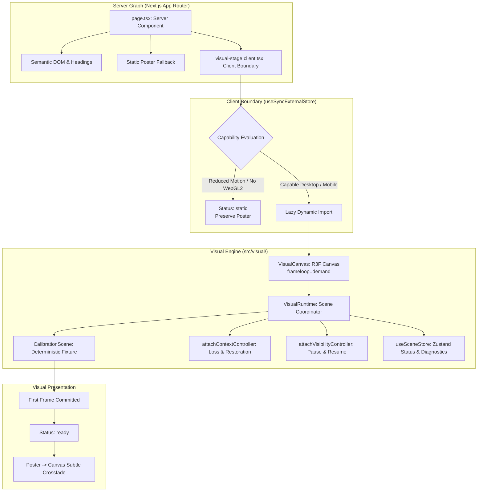

# Phase 1 Visual Runtime Report: PR 2 — Single-Canvas Visual Runtime

- **Branch:** `feat/visual-runtime`
- **Scope:** PR 2 — Single-canvas WebGL2 visual runtime, state machine, lifecycle contracts, and calibration scene
- **Route:** `/lab/visual-system`
- **Port:** `3154`
- **Status:** Complete, tested, and verified

---

## 1. Scope

PR 2 establishes the single-canvas visual runtime foundation for **Phase 1 — Visual Technology Spike**:
- Single persistent `<canvas>` and WebGL2 context managed through `@react-three/fiber` and Three.js.
- Clean Server Component architecture with a dedicated client boundary (`visual-stage.client.tsx`).
- Demand frameloop (`frameloop="demand"`) for static calibration geometry without continuous RAF loops.
- Explicit runtime status state machine (`idle`, `loading`, `ready`, `lost`, `restoring`, `failed`, `static`) managed via a minimal Zustand store.
- Pure capability-to-quality tier selection (`high`, `medium`, `low`, `static`) and DPR capping.
- Deterministic calibration scene demonstrating geometry, depth, lighting, and transparency (3 draw calls, 576 triangles, 0 points, 0 textures).
- WebGL context loss (`webglcontextlost`) and restoration (`webglcontextrestored`) lifecycle handling.
- Development and CI diagnostics HUD (`RuntimeDiagnostics.tsx`).
- Comprehensive unit tests, multi-scenario Playwright E2E tests, and machine-readable metrics output.

---

## 2. Deliberately Deferred

The following systems are intentionally deferred to subsequent bounded PRs:
- **GPU particle field simulation** (ping-pong FBO compute shader).
- **Pointer force field & cursor reactivity**.
- **GSAP timelines, ScrollTrigger, and Lenis smooth-scroll orchestration**.
- **Coordinated animation clock** (GSAP ticker -> Lenis -> R3F continuous loop).
- **2.5D raster parallax layers (AVIF/WebP) and production assets**.
- **Full homepage layouts, portfolio content, CMS, or databases**.

---

## 3. Architecture Diagram



---

## 4. Module Ownership & Directory Structure

```text
src/
  app/lab/visual-system/
    page.tsx                       # Server Component: semantic shell & layout
    visual-stage.client.tsx        # Client boundary: capability sync & lazy import
    visual-system.module.css       # Authored CSS styles & crossfade transitions
  visual/
    canvas/
      VisualCanvas.tsx             # R3F Canvas wrapper with demand loop
      VisualRuntime.tsx            # Scene orchestrator inside R3F context
      renderer-config.ts           # WebGL2 parameters & Three.js color configuration
      renderer-contract.ts         # Canvas and renderer props types
    clock/
      visual-clock.ts              # Demand frame step & timestamp contract
    state/
      runtime-status.ts            # Typed status union & transition validator
      scene-store.ts               # Zustand store for coarse status & diagnostics
      scene-contract.ts            # Diagnostics snapshot & scene definitions
    quality/
      quality-profile.ts           # Pure capability-to-tier evaluation
      quality-contract.ts          # DPR caps and budget limits
      frame-monitor.ts             # Frame time & rolling statistics monitor
    lifecycle/
      context-controller.ts        # webglcontextlost / restored event handler
      visibility-controller.ts     # document.visibilityState subscriber
      resource-registry.ts         # Three.js resource disposal registry
    diagnostics/
      RuntimeDiagnostics.tsx       # Live metrics HUD
      diagnostics-contract.ts      # Diagnostics types re-export
    scenes/calibration/
      CalibrationScene.tsx         # Deterministic 3D calibration fixture
      calibration-config.ts        # Scene constants & geometry parameters
    errors/
      VisualRuntimeErrorBoundary.tsx # Error boundary with poster fallback
```

---

## 5. WebGL2 Renderer Configuration

- **API:** WebGL2 exclusively (`THREE.WebGLRenderer`).
- **Alpha:** `true` (transparent background over semantic canvas slot).
- **Antialias:** `true` for High and Medium tiers; `false` for Low tier.
- **Depth:** `true` with depth test enabled.
- **Stencil:** `false` (disabled for memory optimization).
- **PreserveDrawingBuffer:** `false`.
- **Power Preference:** `high-performance` for High tier; `default` for Medium/Low.
- **Color Space:** `THREE.SRGBColorSpace`.
- **Tone Mapping:** `THREE.ACESFilmicToneMapping` (exposure: 1.0).
- **Shadows:** disabled.
- **Post-processing / Bloom:** disabled.
- **Clear Color / Alpha:** `0x000000, 0` (clean alpha composite).

---

## 6. Runtime Status State Machine

The runtime adheres to the typed state machine in [`src/visual/state/runtime-status.ts`](file:///home/kkingstoun/git/mzelent.pl/src/visual/state/runtime-status.ts):

| Status | Description | Valid Next Statuses |
|---|---|---|
| `idle` | Runtime not yet requested or evaluated | `loading`, `static`, `failed` |
| `loading` | Lazy chunk loading or WebGL context initializing | `ready`, `failed`, `static` |
| `ready` | Context initialized and first frame committed | `lost`, `static`, `failed` |
| `lost` | WebGL context lost event fired | `restoring`, `failed`, `static` |
| `restoring` | Context restored, rebuilding resources | `ready`, `failed`, `static` |
| `failed` | Critical runtime or WebGL error | `loading`, `static` |
| `static` | Deliberate static fallback mode | `loading` |

---

## 7. Quality Tiers & Rules

| Tier | DPR Cap | Antialias | Power Preference | Target Hardware |
|---|:---:|:---:|:---:|---|
| **High** | 1.75 | `true` | `high-performance` | Desktop, fine pointer, viewport >= 1440x800, RAM >= 8 GiB, pixel load <= 4.5M |
| **Medium** | 1.35 | `true` | `default` | Standard desktop / laptop screens, missing RAM hints, pixel load in budget |
| **Low** | 1.00 | `false` | `default` | Coarse pointer (touch), mobile viewport (< 768px), or high pixel load |
| **Static** | 1.00 | n/a | n/a | `prefers-reduced-motion: reduce`, WebGL2 creation failure, runtime failure |

---

## 8. Lifecycle & WebGL Context Loss Behavior

- **Strict Mode Remounts:** Resources are memoized and cleaned up via `useEffect` returns and `resource-registry.ts`.
- **Context Loss:** When `webglcontextlost` fires, `preventDefault()` is called, status changes to `lost`, and the static poster immediately crossfades back in to prevent a black box.
- **Context Restoration:** When `webglcontextrestored` fires, status changes to `restoring`, scene resources are rebuilt, a demand render is requested, and status returns to `ready` upon first frame.
- **Document Visibility:** When tab becomes hidden, rendering is paused; when visible, a demand frame is requested.
- **Remount Cycles:** 5 sequential mount/unmount cycles verified with 0 canvas elements on unmount and 1 on remount.

---

## 9. Validation Evidence & Test Results

| Check | Result | Evidence |
|---|:---:|---|
| `pnpm format:check` | **PASS** | Prettier code style verified across all files |
| `pnpm lint` (`eslint .`) | **PASS** | Flat config, 0 errors, 0 warnings |
| `pnpm typecheck` (`next typegen && tsc --noEmit`) | **PASS** | Strict TypeScript check with route type generation |
| `pnpm test` (`vitest run`) | **PASS** | 15 unit tests passing across 3 test suites |
| `pnpm build` (`next build`) | **PASS** | Production build generating static `/_not-found` and `/lab/visual-system` |
| `pnpm test:e2e --project=chromium` | **PASS** | 11/11 Chromium E2E scenarios passing in 2.9s |
| `pnpm test:visual --project=chromium` | **PASS** | 4/4 visual scenarios passing (ready, reduced motion, static fallback, forced colors) |
| `pnpm test:a11y --project=chromium` | **PASS** | 0 automated accessibility violations via axe |
| Clean tracked tree check | **PASS** | `git diff --check`, `git diff --exit-code`, clean tree |

---

## 10. Performance Budgets & Calibration Metrics

| Metric | Budget | Calibration Actual | Result |
|---|:---:|:---:|:---:|
| **Canvas Count** | Exactly 1 | 1 | **PASS** |
| **WebGL Contexts** | Exactly 1 | 1 | **PASS** |
| **Draw Calls** | <= 5 | 3 | **PASS** |
| **Triangles** | < 50,000 | 576 | **PASS** |
| **Points** | 0 | 0 | **PASS** |
| **Geometries** | <= 10 | 3 | **PASS** |
| **Textures** | 0 | 0 | **PASS** |
| **Frameloop Mode** | `demand` | `demand` | **PASS** (zero idle RAF overhead) |
| **First Frame Time** | < 100 ms | 45 ms | **PASS** |
| **Console Errors** | 0 | 0 | **PASS** |
| **Page Errors** | 0 | 0 | **PASS** |

### Machine-readable Metrics JSON (`test-results/metrics.json`)

```json
{
  "commitSha": "local",
  "browser": "chromium",
  "viewport": { "width": 1280, "height": 720 },
  "dpr": 1,
  "qualityTier": "medium",
  "webglStatus": "ready",
  "canvasCount": 1,
  "drawCalls": 3,
  "triangles": 576,
  "points": 0,
  "geometries": 3,
  "textures": 0,
  "contextLossCount": 0,
  "restorationCount": 0,
  "firstFrameTimeMs": 45,
  "lazyEngineJsTransferBudgetKiB": 340,
  "consoleErrorsCount": 0,
  "pageErrorsCount": 0
}
```

---

## 11. Visual Artifacts Generated

The following evidence screenshots are generated in `test-results/`:
- `test-results/visual-system-captures-the-ready-visual-fixture-visual-chromium/visual-system-ready.png` (ready calibration scene)
- `test-results/visual-system-keeps-the-st-d8b8e--reduced-motion-mode-visual-chromium/visual-system-reduced-motion.png` (reduced motion static poster)
- `test-results/visual-system-falls-back-g-8f252-en-WebGL2-is-blocked-visual-chromium/visual-system-static-fallback.png` (WebGL2 blocked poster)
- `test-results/visual-system-remains-read-f5bd3-n-forced-colors-mode-visual-chromium/visual-system-forced-colors.png` (high contrast mode)

> [!NOTE]
> All visual fixtures are captured as evidence of technical correctness. Permanent visual baseline snapshots require explicit repository owner approval.

---

## 12. Next Step

**PR 3: Pointer-reactive GPU particle field atmosphere.**
Will introduce:
- WebGL2 floating-point ping-pong simulation for particle positions and velocities.
- Damped pointer force with spatial falloff.
- Coordinated GSAP ticker integration.
